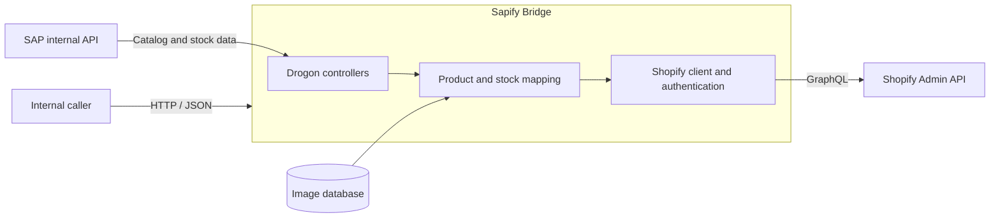

# Sapify Bridge

> A production-oriented integration service that synchronizes product catalog and inventory data from SAP to Shopify.


Sapify Bridge is a C++ service developed for **Mascaró** to connect its SAP-based business systems with Shopify. It exposes an asynchronous HTTP API that retrieves catalog and inventory data from the internal SAP API, maps it to Shopify's data model, and publishes it through the Shopify Admin GraphQL API.

## Project status

The two primary synchronization flows are complete:

| Capability | Status | Direction |
| --- | --- | --- |
| Product catalog synchronization | Ready | SAP → Shopify |
| Inventory synchronization | Ready | SAP → Shopify |

Product synchronization supports catalog data, variants, prices, media, SEO fields, and metafields. Inventory synchronization maps SAP warehouses to their corresponding Shopify locations and updates stock at variant level.

## Key features

- Asynchronous HTTP server and client operations powered by Drogon coroutines.
- Product creation and updates through Shopify's `productSet` GraphQL mutation.
- Product variant mapping based on size and SKU data from SAP.
- Inventory synchronization across multiple physical and logical locations.
- Product image lookup, ordering, and publishing.
- Shopify metafield and metaobject integration.
- OAuth client-credentials authentication with cached access-token renewal.
- Structured JSON serialization and deserialization with Glaze.
- Environment-based configuration for local and production deployments.
- Health-check endpoint for monitoring and orchestration.

## Architecture



The service is organized into four main areas:

- `controllers`: HTTP endpoints and synchronization orchestration.
- `services`: Shopify authentication and GraphQL communication.
- `mapping`: conversion from SAP records to Shopify products and variants.
- `utils`: stock locations, media, metafields, text, and variant helpers.

## Synchronization flows

### Product catalog

`POST /upload/items` accepts a list of SAP article references. For every requested article, the service:

1. Fetches header and variant data from the SAP API.
2. Checks whether the product already exists in Shopify.
3. Maps product information, sizes, SKUs, prices, SEO data, and media.
4. Creates or updates the Shopify product and its variants.
5. Publishes the associated metafields.

Products are matched using the SAP article reference, allowing the same operation to handle both initial publication and later updates.

### Inventory

`POST /upload/stocks` accepts the same article selection format. The service retrieves current stock from SAP, maps each SAP warehouse to a Shopify location, and updates inventory for the corresponding SKUs.

Warehouse-to-location mappings are maintained in `include/utils/Stocks.hpp`. This mapping must be reviewed whenever a store, warehouse, or Shopify location is added, removed, or replaced.

## API reference

### Health check

```http
GET /health
```

Successful response:

```json
{
  "status": "ok"
}
```

### Synchronize products

```http
POST /upload/items
Content-Type: application/json
```

### Synchronize inventory

```http
POST /upload/stocks
Content-Type: application/json
```

Both synchronization endpoints accept an SAP article list:

```json
{
  "articulos": ["1231_001", "1232_002"]
}
```

## Technology stack

| Technology | Purpose |
| --- | --- |
| C++23 | Core application and domain logic |
| Drogon | Asynchronous HTTP server and client |
| Shopify Admin GraphQL API | Product and inventory operations |
| Glaze | JSON serialization and deserialization |
| PostgreSQL | Product image metadata and integration data |
| CMake | Build configuration |
| Ninja or Make | Build execution |

## Requirements

- CMake 3.15 or newer.
- A C++23-compatible compiler and standard library, including `<print>` support.
- Ninja or Make.
- Drogon and Glaze development packages discoverable by CMake.
- Network access to the SAP API, Shopify, and the configured PostgreSQL services.
- Shopify application credentials with the permissions required to manage products, metafields, media, and inventory.

## Configuration

Copy the example environment file and provide the deployment-specific values:

```sh
cp .env.example .env
```

| Variable | Description | Default |
| --- | --- | --- |
| `APP_HOST` | HTTP listen address | `0.0.0.0` |
| `APP_PORT` | HTTP listen port | `8080` |
| `LOG_LEVEL` | Application log level | `info` |
| `SHOPIFY_MASCARO_DOMAIN` | Mascaró Shopify store domain | None |
| `SHOPIFY_MASCARO_CLIENT_ID` | Shopify application client ID | None |
| `SHOPIFY_MASCARO_CLIENT_SECRET` | Shopify application client secret | None |
| `SHOPIFY_API_VERSION` | Shopify Admin API version | `2026-07` |
| `APISAP` | SAP API host and port | `apisap:3000` |
| `PICTURES_BASE_URL` | Public base URL for product images | `pictures.mascaro.com` |

The application loads `.env` during local development. In production, inject these values through the runtime environment and keep secrets outside source control.

Database connections are configured in `config.json`. Replace local development values with secret-managed deployment configuration before running the service in another environment.

## Build and run

Run the following commands from the repository root.

### Debug build

```sh
cmake -S . -B build -DCMAKE_BUILD_TYPE=Debug
cmake --build build --parallel
./build/sapify-bridge
```

### Release build

```sh
cmake -S . -B build/release -DCMAKE_BUILD_TYPE=Release
cmake --build build/release --parallel
./build/release/sapify-bridge
```

The service listens on the configured `APP_HOST` and `APP_PORT`. Confirm startup with:

```sh
curl http://127.0.0.1:8080/health
```

### Clean builds

Rebuild Debug from a clean state:

```sh
cmake --build build --clean-first --parallel
```

Remove Debug build artifacts while preserving the CMake configuration:

```sh
cmake --build build --target clean
```

## Development notes

- Keep the Shopify API version consistent between configuration and the GraphQL endpoint.
- Update the warehouse mapping before enabling synchronization for a new location.
- Preserve existing Shopify variant IDs during product updates so inventory associations and order history remain intact.
- Products without the required SAP variant or image data should be treated as synchronization failures and reviewed rather than published partially.
- Never commit `.env` files, access tokens, client secrets, or production database credentials.

## Zed tasks

Development tasks are available in [`.zed/tasks.json`](.zed/tasks.json). Open Zed's command palette, select `task: spawn`, and choose the relevant CMake or formatting task.

| Task | Action |
| --- | --- |
| `C++: formatear todo` | Formats all C++ source and header files. |
| `CMake: configurar (Debug)` | Configures the Debug build in `build/`. |
| `CMake: compilar (Debug)` | Builds the Debug target. |
| `CMake: RUN` | Runs the Debug executable. |
| `CMake: limpiar (Debug)` | Removes Debug build artifacts. |
| `CMake: configurar (Release)` | Configures the Release build in `build/release/`. |
| `CMake: compilar (Release)` | Builds the Release target. |

## Maintenance checklist

When updating the integration:

1. Verify SAP response contracts against the types in `include/controllers/types/PushTypes.hpp`.
2. Review Shopify API-version compatibility and required application scopes.
3. Validate warehouse and Shopify location mappings.
4. Build in both Debug and Release modes.
5. Run health, product synchronization, and inventory synchronization checks against a non-production store before deployment.
